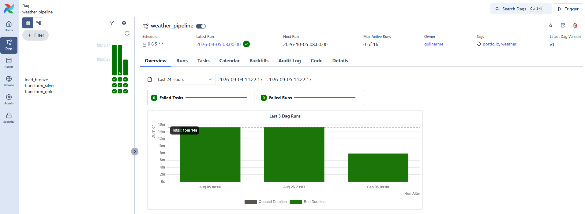
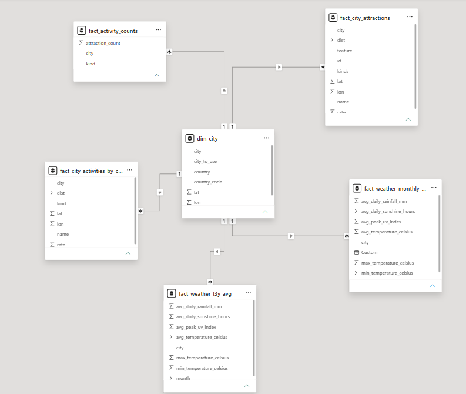

# Trip Planner Data Platform

This project was built to demonstrate practical data engineering skills - ingestion, transformation, orchestration, and data modeling - rather than as a polished analytics product.

An end-to-end data engineering pipeline that ingests weather, city, and points-of-interest data from multiple public APIs, processes it through a bronze/silver/gold medallion architecture on AWS S3, and orchestrates the recurring pipeline with Apache Airflow running in Docker.

---

## Architecture Overview

```
                 ┌──────────────────┐        ┌───────────────────┐        ┌──────────────────┐
   APIs   ────►  │     BRONZE       │  ───►  │     SILVER        │  ───►  │      GOLD        │
                 │  (raw, untouched)│        │ (cleaned, typed,  │        │ (aggregated,     │
                 │                  │        │  deduplicated)    │        │  business-ready) │
                 └──────────────────┘        └───────────────────┘        └──────────────────┘
                        S3                          S3                    S3 (star schema)
```

- **Bronze**: raw API responses landed exactly as received (JSON), partitioned by source and city. Immutable - never overwritten or deleted, preserving full reprocessability.
- **Silver**: cleaned, typed, deduplicated data at a consistent grain (e.g., one row per city per day for weather).
- **Gold**: aggregated, purpose-built tables following a star schema (`dim_city` + multiple `fact_` tables), ready for direct consumption by a BI tool or dashboard.

### Orchestration

The **weather** pipeline is orchestrated end-to-end with **Apache Airflow**, running locally via **Docker Compose**. It runs monthly (5th of each month), fetching the previous complete month and rebuilding the silver/gold layers. Below there is a picture with DAG's run history, showing successful scheduled executions.



**Cities** and **activities/points-of-interest** are treated as largely static reference data and are ingested via one-time/manually-triggered scripts rather than a recurring schedule - a deliberate choice reflecting that this data doesn't meaningfully change month to month.

---

## Data Sources

| Source | Data | Access pattern |
|---|---|---|
| [Open-Meteo](https://open-meteo.com/) | Historical hourly weather (temperature, rain, UV, sunshine) | Recurring - backfilled 3 years, then incremental monthly loads |
| [SimpleMaps World Cities](https://simplemaps.com/data/world-cities) | City names, coordinates, population, country | One-time load |
| [OpenTripMap](https://opentripmap.io/) | Points of interest / attractions near each city | One-time load |

City selection: top 50 cities globally by population, from the SimpleMaps dataset.

---

## Data Model (Gold Layer - Star Schema)

The gold layer follows a star schema with `dim_city` as the central dimension, connected to multiple fact tables covering weather and points of interest.



This project has more fact tables than dimensions - a natural consequence of having one core entity (a city) measured across several independent data sources and consumption needs, rather than the more commonly illustrated "one large fact, many small dimensions" shape. The defining star-schema rule still holds: every fact table relates only through the shared dimension, never directly to another fact table.

**Tables:**
- `dim_city` - city name, country, coordinates, population
- `fact_weather_monthly_by_year` - monthly weather aggregates, one row per city/month/year (trend over time)
- `fact_weather_l3y_avg` - monthly weather aggregates averaged across a rolling 3-year window, one row per city/month (typical seasonal pattern)
- `fact_city_attractions` - deduplicated list of top attractions per city
- `fact_city_activities_by_category` - attractions exploded by category, for filtering
- `fact_activity_counts` - count of attractions per city per category

---

## Key Design Decisions

**Bronze is append-only and immutable.** Raw API responses are never modified or deleted, even as new data is ingested - this preserves the ability to fully reprocess history if downstream logic changes or a bug is found. The "last 3 years" constraint is applied only at the gold layer, as a filter, not by deleting raw source data.

**Backfill and incremental loads are separate, explicit functions.** A one-time `backfill_*` function populates historical data; a separate `load_*` function (the one wired into the Airflow DAG) fetches only the previous complete month on each scheduled run. This avoids accidentally re-triggering a full historical pull on a routine run.

**Deduplication is applied where data quality issues were found, not preemptively everywhere.** For example, OpenTripMap sources from OpenStreetMap, which frequently represents a single real-world landmark as multiple separate objects (a node, a way, and a relation). This was identified during data validation and addressed with a two-pass deduplication: first by rounded geographic proximity, then by exact name, keeping the highest-rated entry in each case. This is a heuristic, not a perfect solution - documented here rather than over-engineered.

**Hourly-to-daily aggregation choices matter and were revisited.** Cumulative metrics (sunshine duration, rainfall) are summed within a day before being averaged across a month - averaging raw hourly values directly would understate them by diluting them with nighttime zeros. The same issue was initially missed for UV index; it was corrected to take the daily *maximum* (the genuine midday peak) before averaging across the month, rather than a 24-hour mean that is meaningless for a metric that is zero for half of every day.

**PySpark is used for the GOLD transformation layer for demonstration purposes.** At this project's actual data volume, pandas would be equally sufficient - Spark's value would scale with more cities or longer history.

---

## Tech Stack

- **Ingestion**: Python, `requests`
- **Storage**: AWS S3 (bronze/silver/gold layers)
- **Transformation**: PySpark, pandas
- **Orchestration**: Apache Airflow (Docker Compose, custom image with Java + project dependencies)
- **Security/cost management**: scoped IAM policy (least-privilege, bucket-specific), encrypted-at-rest storage, AWS Budget alerts

---

## Known Limitations

- Deduplication of points-of-interest is heuristic (proximity + exact-name matching), not a full entity-resolution solution.
- Credentials are managed via a local `.env` file rather than a secrets manager or Airflow Connections - appropriate for a local portfolio project, not for production.

---

## Repository Structure

```
├── dags/
│   └── weather_pipeline_dag.py
├── src/
│   ├── load_cities_to_bronze.py
│   ├── load_weather_data_to_bronze.py       # includes backfill_weather_to_bronze()
│   ├── load_activities_to_bronze.py
│   ├── transform_cities_silver.py
│   ├── transform_weather_data_silver.py
│   ├── transform_activities_data_silver.py
│   ├── transform_cities_gold.py
│   ├── transform_weather_data_month_year_gold.py
│   └── transform_activities_data_gold.py
├── Dockerfile
├── docker-compose.yaml
├── requirements.txt
└── README.md
```

---

## Running This Project

1. Set up a Python virtual environment and install `requirements.txt`
2. Configure AWS credentials and API keys in a local `.env` file (see `.env.example` - not committed)
3. Run the one-time reference data loads: `load_cities_to_bronze.py`, `transform_cities_silver.py`, `transform_cities_gold.py`
4. Run the one-time weather backfill: `python src/load_weather_data_to_bronze.py backfill`
5. Run the one-time activities load: `load_activities_to_bronze.py` → silver → gold
6. Start Airflow: `docker-compose up airflow-init` then `docker-compose up`
7. Enable and trigger the `weather_pipeline` DAG at `localhost:8080` for ongoing monthly weather updates
